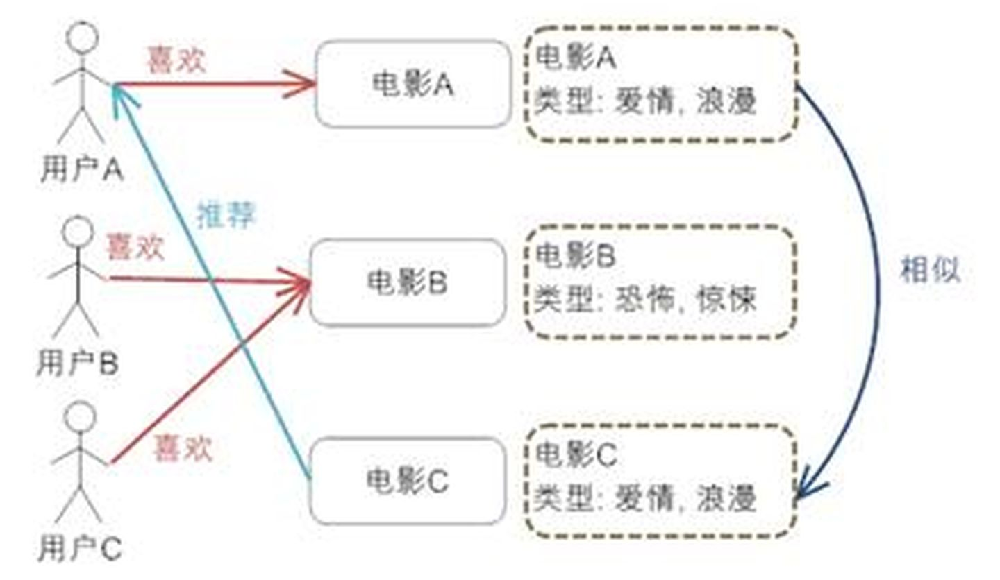

# 智能推荐分类

* 基于内容的推荐
* 协同过滤推荐
    - 基于用户的协同过滤推荐（User-based Recommendation）
    - 基于项目的协同过滤推荐（Item-based Recommendation）
    - 基于模型的协同过滤推荐（Model-based Recommendation）
* 基于模型的推荐（Model-based Recommendation）

### 基于内容过滤的推荐（Content-based Recommendation）

基于内容的推荐算法，原理是用户喜欢和自己关注过的Item在内容上类似的Item，比如你看了哈利波特I，基于内容的推荐算法发现哈利波特II-VI，与你以前观
看的在内容上面（共有很多关键词）有很大关联性，就把后者推荐给你，这种方法可以避免Item的冷启动问题（冷启动：如果一个Item从没有被关注过，其他推荐
算法则很少会去推荐，但是基于内容的推荐算法可以分析Item之间的关系，实现推荐），弊端在于推荐的Item可能会重复，典型的就是新闻推荐，如果你看了一则
关于MH370的新闻，很可能推荐的新闻和你浏览过的，内容一致；另外一个弊端则是对于一些多媒体的推荐（比如音乐、电影、图片等)由于很难提内容特征，则很
难进行推荐，一种解决方式则是人工给这些Item打标签。



优点：
* 它能很好的建模用户的口味，能提供更加精确的推荐。

缺点：
* 需要对物品进行分析和建模，推荐的质量依赖于对物品模型的完整和全面程度。在现在的应用中我们可以观察到关键词和标签（Tag）被认为是描述物品元数据
  的一种简单有效的方法。
* 物品相似度的分析仅仅依赖于物品本身的特征，这里没有考虑人对物品的态度。
* 因为需要基于用户以往的喜好历史做出推荐，所以对于新用户有”冷启动”的问题。


### 基于人口统计学的推荐（Demographic-based Recommendation）

基于人口统计学的推荐机制（Demographic-based Recommendation）是一种最易于实现的推荐方法，它只是简单的根据系统用户的基本信息发现用户的相关
程度，然后将相似用户喜爱的其他物品推荐给当前用户，下图给出了这种推荐的工作原理。


优点：
* 因为不使用当前用户对物品的喜好历史数据，所以对于新用户来讲没有”冷启动（Cold Start）”的问题。
* 这个方法不依赖于物品本身的数据，所以这个方法在不同物品的领域都可以使用，它是领域独立的（domain-independent）。

缺点：
* 这个方法可能涉及到一些与信息发现问题本身无关却比较敏感的信息，比如用户的年龄等，这些用户信息不是很好获取。
* 对用户进行分类的方法过于粗糙，尤其是对品味要求较高的领域，比如图书，电影和音乐等领域，无法得到很好的推荐效果。


### 基于协同过滤的推荐(Collaborative Filtering-based Recommendation)

随着 Web2.0 的发展，Web 站点更加提倡用户参与和用户贡献，因此基于协同过滤的推荐机制因运而生。它的原理很简单，就是根据用户对物品或者信息的偏好，
发现物品或者内容本身的相关性，或者是发现用户的相关性，然后再基于这些关联性进行推荐。基于协同过滤的推荐可以分为三个子类：基于用户的推荐（
User-based Recommendation），基于项目的推荐（Item-based Recommendation）和基于模型的推荐（Model-based Recommendation）。下面我们
一个一个详细的介绍着三种协同过滤的推荐机制。

#### 基于用户的协同过滤推荐

基于用户的协同过滤推荐的基本原理是，根据所有用户对物品或者信息的偏好，发现与当前用户口味和偏好相似的”邻居”用户群，在一般的应用中是采用计算
”K-邻居”的算法；然后，基于这 K 个邻居的历史偏好信息，为当前用户进行推荐。下图给出了原理图。


User-CF算法思想：先找到目标用户的相似用户（即与他有相同兴趣的其他用户），然后把 相似用户喜欢的 且 目标用户未作出行为的 物品推荐给目标用户。

基于用户的协同过滤推荐机制和基于人口统计学的推荐机制都是计算用户的相似度，并基于”邻居”用户群计算推荐，但它们所不同的是如何计算用户的相似度，基
于人口统计学的机制只考虑用户本身的特征，而基于用户的协同过滤机制可是在用户的历史偏好的数据上计算用户的相似度，它的基本假设是，喜欢类似物品的用
户可能有相同或者相似的口味和偏好。


#### 基于项目的协同过滤推荐（Item-based Recommendation）

Item-CF算法思想：为当前用户推荐——与当前用户感兴趣物品相似的 且 当前用户没有接触的物品。

基于项目的协同过滤推荐的基本原理也是类似的，只是说它使用所有用户对物品或者信息的偏好，发现物品和物品之间的相似度，然后根据用户的历史偏好信息，
将类似的物品推荐给用户，下图很好的诠释了它的基本原理。
与上面讲的类似，基于项目的协同过滤推荐和基于内容的推荐其实都是基于物品相似度预测推荐，只是相似度计算的方法不一样，前者是从用户历史的偏好推断，
而后者是基于物品本身的属性特征信息。


同时协同过滤，在基于用户和基于项目两个策略中应该如何选择呢？其实基于项目的协同过滤推荐机制是 Amazon 在基于用户的机制上改良的一种策略，因为在
大部分的 Web 站点中，物品的个数是远远小于用户的数量的，而且物品的个数和相似度相对比较稳定，同时基于项目的机制比基于用户的实时性更好一些。但也
不是所有的场景都是这样的情况，可以设想一下在一些新闻推荐系统中，也许物品，也就是新闻的个数可能大于用户的个数，而且新闻的更新程度也有很快，所以
它的形似度依然不稳定。所以，其实可以看出，推荐策略的选择其实和具体的应用场景有很大的关系。


#### 基于模型的协同过滤（Model-based Recommendation）

基于模型的协同过滤推荐就是基于样本的用户喜好信息，训练一个推荐模型，然后根据实时的用户喜好的信息进行预测，计算推荐。
基于协同过滤的推荐机制是现今应用最为广泛的推荐机制，它有以下几个显著的优点：

优点：
* 它不需要对物品或者用户进行严格的建模，而且不要求物品的描述是机器可理解的，所以这种方法也是领域无关的。
* 这种方法计算出来的推荐是开放的，可以共用他人的经验，很好的支持用户发现潜在的兴趣偏好

历史：
* 方法的核心是基于历史数据，所以对新物品和新用户都有”冷启动”的问题。
* 推荐的效果依赖于用户历史偏好数据的多少和准确性。
* 在大部分的实现中，用户历史偏好是用稀疏矩阵进行存储的，而稀疏矩阵上的计算有些明显的问题，包括可能少部分人的错误偏好会对推荐的准确度有很大的影响等等。
* 对于一些特殊品味的用户不能给予很好的推荐。
* 由于以历史数据为基础，抓取和建模用户的偏好后，很难修改或者根据用户的使用演变，从而导致这个方法不够灵活。


最常用的是基于协同过滤系统的推荐，是利用用户之间的相似性来推荐用户感兴趣的信息，个人通过合作的机制给予信息相当程度的回应（如评分）并记录下来以
达到过滤的目的进而帮助别人筛选信息，回应不一定局限于特别感兴趣的，特别不感兴趣信息的纪录也相当重要。
但有很难解决的两个问题：
* 一个是稀疏性，即在系统使用初期由于系统资源还未获得足够多的评价，很难利用这些评价来发现相似的用户。
* 另一个是可扩展性，随着系统用户和资源的增多，系统的性能会越来越差。

协同过滤算法，原理是用户喜欢那些具有相似兴趣的用户喜欢过的商品，比如你的朋友喜欢电影哈利波特I，那么就会推荐给你，这是最简单的基于用户的协同过滤
算法（user-based collaboratIve filtering），还有一种是基于Item的协同过滤算法（item-based collaborative filtering），这两种方法都
是将所有用户的数据读入到内存中进行运算的，因此成为Memory-based Collaborative Filtering，另一种则是Model-based collaborative 
filtering，包括Aspect Model，pLSA，LDA，聚类，SVD，Matrix Factorization等，这种方法训练过程比较长，但是训练完成后，推荐过程比较快。

### 基于知识的推荐算法
最后一种方法是基于知识的推荐算法，也有人将这种方法归为基于内容的推荐，这种方法比较典型的是构建领域本体，或者是建立一定的规则，进行推荐。

### 混合的推荐机制
混合推荐算法，则会融合以上方法，以加权或者串联、并联等方式尽心融合。当然，推荐系统还包括很多方法，其实机器学习或者数据挖掘里面的方法，很多都可
以应用在推荐系统中，比如说LR、GBDT、RF（这三种方法在一些电商推荐里面经常用到），社交网络里面的图结构等，都可以说是推荐方法。
在现行的 Web 站点上的推荐往往都不是单纯只采用了某一种推荐的机制和策略，他们往往是将多个方法混合在一起，从而达到更好的推荐效果。关于如何组合各
个推荐机制，这里讲几种比较流行的组合方法。

#### 加权的混合（Weighted Hybridization）
用线性公式（linear formula）将几种不同的推荐按照一定权重组合起来，具体权重的值需要在测试数据集上反复实验，从而达到最好的推荐效果。

#### 切换的混合（Switching Hybridization）
前面也讲到，其实对于不同的情况（数据量，系统运行状况，用户和物品的数目等），推荐策略可能有很大的不同，那么切换的混合方式，就是允许在不同的情况
下，选择最为合适的推荐机制计算推荐。

#### 分区的混合（Mixed Hybridization）
采用多种推荐机制，并将不同的推荐结果分不同的区显示给用户。其实，Amazon，当当网等很多电子商务网站都是采用这样的方式，用户可以得到很全面的推荐，
也更容易找到他们想要的东西。

#### 分层的混合（Meta-Level Hybridization）
采用多种推荐机制，并将一个推荐机制的结果作为另一个的输入，从而综合各个推荐机制的优缺点，得到更加准确的推荐。


# 关键词

* 稀疏性
* 冷启动
* 商品深度
* 零结果率

### 冷启动

我们首先来回答新加入的“好”内容快速被发现和提拔起来？这个涉及到推荐冷启动问题，包括item冷启动、user冷启动、系统冷启动等诸多方面，这里涉及到的
是item冷启动，任何一个新产生的作品，成为所谓“全局优秀的内容被大家看到”要经历千山万水的考验。不同的场景、不同的业务量、不同的公司采用的方式各不
相同，这里简单介绍老东家的短视频推荐item冷启动策略。任何一个新产生的item（视频作品）首先要通过算法审核，包括但不仅限于鉴黄、模糊、黑屏等，通过
初步审核后一般会过滤掉大量的新作品，大部分公司还有一个视频内容挖掘初步打分，若分数奇低（比较低的下限过滤）一般也会被直接干掉。经过这些审核之后
进入爬坡测试阶段，这里简单介绍一下三级爬坡的理念，所谓的“三级爬坡”是指一个新的作品通过审核进入一级测试推荐池，通过测试进入二级测试推荐池，再然
后进入三级精品池（即全局优秀内容大规模推荐）。这里的一、二级测试推荐池是给予item小数量级的曝光，然后收集用户反馈（如点赞评论等），若反馈较好，
则通过测试（这里一般会采用多臂老虎机思路加快测试），通过一、二级的测试，可以初步认为用户反馈良好，这时候就会让作品进入三级精品池，也就是问题描
述中的“全局优秀的内容被大家看到”。

# 问题
* "稀疏性" 和 "冷启动" 都是初期数据没有关注或关联，导致无法推荐此item，那含义有什么区别？
* "基于item的协同过滤"和"基于内容过滤的推荐"有什么区别？
    ```
    item-based cf仍然是纯分析用户历史行为记录的，其基本原理是，喜欢Item A 的用户，其可能也会喜欢与Item A相似的Item B，相似度的计算是基于
    历史行为信息，计算每两个item之间的相似度（比如有多少人喜欢A，有多少人喜欢B，有多少人既喜欢A又喜欢B，A和B的相似度，就可以计算为共同喜欢A
    和B的用户个数除以喜欢A或喜欢B的总用户数，当然有很多其他的相似度计算方法，如cos，皮尔逊等），而基于内容的推荐算法则不同，其引入了关于item
    的内容信息，来计算item与item之间的相似度，比如在网页的推荐中，可以计算两个网页在内容上是否相似（比如是否都是介绍两会的，是否是关于政治的，
    等）。
    ```


# 参考
* [基于内容的推荐算法（推荐系统）（一）](https://blog.csdn.net/sinat_18497785/article/details/51263118)
* [推荐算法有哪些？](https://www.zhihu.com/question/20326697)
* [协同过滤和基于内容推荐有什么区别？](https://www.zhihu.com/question/19971859/answer/82255871)
* [推荐引擎初探 —— 深入了解推荐引擎机制](https://developer.ibm.com/zh/articles/1103-zhaoct-recommstudy1/)


