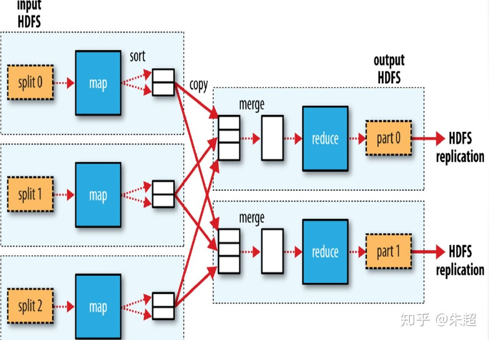

# 什么是 MapReduce
MapReduce 是 Hadoop 的核心组件之一，用于处理大数据集的相关实现。MapReduce 计算模型借鉴函数型语言（如 LISP）中内置的 
Map 和 Reduce 概念，基于分治法（Divide-and-Conquer）将大规模数据集划分为小数据集，小数据集划分为更小数据集，将最终划
分的小数据集分布到集群节点上以并行方式完成计算处理；然后再将计算结果递归融汇，得到最后处理结果。

MapReduce是一种分布式计算框架 ，以一种可靠的，具有容错能力的方式并行地处理上TB级别的海量数据集。
主要用于搜索领域，解决海量数据的计算问题。

# MapReduce 原语
相同key的键值对为一组调用一次Reduce方法，方法内迭代这组数据进行计算。

# MapReduce 的组成

MR有两个阶段组成：Map和Reduce，用户只需实现map()和reduce()两个函数，即可实现分布式计算。

### Map

Map()负责把一个大的block块进行切片并计算，我们需要数据一对一的元素的映射转换，比如说进行截取，进行过滤，或者任何的转换操作，
这些一对一的元素转换就称作是Map；map操作会将集合中的元素从一种形式转化成另一种形式，在这种情况下，输入的键值对会被转换成零到
多个键值对输出。其中输入和输出的键必须完全不同，而输入和输出的值则可能完全不同。

### Reduce
Reduce() 负责把Map()切片的数据进行汇总、计算，主要就是元素的聚合，就是多个元素对一个元素的聚合，比如求Sum等，这就是Reduce。
某个键的所有键值对都会被分发到同一个reduce操作中。确切的说，这个键和这个键所对应的所有值都会被传递给同一个Reducer。reduce
过程的目的是将值的集合转换成一个值（例如求和或者求平均），或者转换成另一个集合。这个Reducer最终会产生一个键值对。需要说明的是，
如果job不需要reduce过程的话，那么reduce过程也是可以不用的。

# 怎么用 MapReduce

1. 第一步对输入的数据进行切片，每个切片分配一个map()任务，map()对其中的数据进行计算，对每个数据用键值对的形式记录，然后输出到环形缓冲区（图中sort的位置）。
2. map（）中输出的数据在环形缓冲区内进行快排，每个环形缓冲区默认大小100M，当数据达到80M时（默认），把数据输出到磁盘上。形成很多个内部有序整体无序的小文件。
3. 框架把磁盘中的小文件传到Reduce()中来，然后进行归并排序，最终输出。

# MapReduce 和 Hadoop

MapReduce 属于多指令流多数据流（MIMD）类型，是一种运行在 Hadoop 集群架构上的并行计算编程模型。在 Hadoop 集群上，
MapReduce1.0 采用 Master/Slave 架构，主要包括 Client、JobTracker、TaskTracker 及 Task 4 个组件，如图所示：

### 四个组件

* clint：
用户编写的 MapReduce 程序通过 Client 提交到 JobTracker 端，用户可以通过 Client 提供的一些接口查看作业运行状态。

* JobTracker：
运行在 NameNode 上，提供集群资源管理的调配和作业调度管理，监控所有 TaskTracker 与作业的运行状况，一旦发现失败，
就将相应的任务转移到其他节点。JobTracker 还会跟踪任务的执行进度、资源使用量等信息，并将这些信息告诉任务调度器（TaskScheduler），
而调度器会在资源出现空闲时，选择合适的任务去使用这些资源。

* TaskTracker：
运行在 DataNode 上，负责执行 JobTracker 指派的具体任务。TaskTracker 会周期性地通过「心跳（Heartbeat）」将本节点上
资源的使用情况和任务的运行进度汇报给 JobTracker，同时接收 JobTracker 发送过来的命令并执行相应的操作（如启动新任务、杀死任务等）。
TaskTracker 使用「Slot」等量划分本节点上的资源（CPU、内存等）。一个 Task 获取到一个 Slot 后才有机会运行，而 Hadoop 调度器的
作用就是将各个 TaskTracker 上的空闲 Slot 分配给 Task 使用。Slot 分为 Map Slot 和 Reduce Slot 两种，分别供 MapTask 和 
Reduce Task 使用。

* Task：
Task 分为 Map Task 和 Reduce Task 两种，均由 TaskTracker 启动。

### Hadoop中的Map和Reduce

MapReduce 计算模型中主要有 Map（映射）和 Reduce（简化）两类任务。Map 负责输入数据的分片、转化、处理，输出中间结果文件；
Reduce 以 Map 的输出文件为输入，对中间结果进行合并处理，得到最终结果并写入 HDFS。这两类任务都有多个进程运行在 DataNode 上，
相互间通过 Shuffle 阶段交换数据。

### Hadoop2.0改进

MapReduce1.0 体系结构设计存在单点故障、JobTracker 包揽任务过重、容易出现内存溢出及资源划分不合理等缺陷。为了克服 MapReduce1.0 
的缺陷，Hadoop2.0 以后的版本引入了集群管理器 YARN，形成了 MapReduce2.0，其基本思路是「放权」，把 JobTracker 的三大功能
（资源管理、任务调度和任务监控）进行拆分，分别交给不同的新组件 Resource Manager、ApplicationMaster 和 NodeManager 去处理，
具体可参阅相关文献。

# MapReduce 和 Spark

Mapreduce是Hadoop1.0的核心，Spark出现慢慢替代Mapreduce。那么为什么Mapreduce还在被使用呢？因为有很多现有的应用还依赖于它，
它不是一个独立的存在，已经成为其他生态不可替代的部分，比如pig，hive等。尽管MapReduce极大的简化了大数据分析，但是随着大数据需求
和使用模式的扩大，用户的需求也越来越多：

* 更复杂的多重处理需求（比如迭代计算, ML, Graph）；
* 低延迟的交互式查询需求（比如ad-hoc query）

而MapReduce计算模型的架构导致上述两类应用先天缓慢，用户迫切需要一种更快的计算模型，来补充MapReduce的先天不足。
Spark的出现就弥补了这些不足，我们来了解一些Spark的优势：

* 每一个作业独立调度，可以把所有的作业做一个图进行调度，各个作业之间相互依赖，在调度过程中一起调度，速度快。
* 所有过程都基于内存，所以通常也将Spark称作是基于内存的迭代式运算框架。
* spark提供了更丰富的算子，让操作更方便。
* 更容易的API：支持Python，Scala和Java

其实spark里面也可以实现Mapreduce，但是这里它并不是算法，只是提供了map阶段和reduce阶段，但是在两个阶段提供了很多算法。
如Map阶段的map, flatMap, filter, keyBy，Reduce阶段的reduceByKey, sortByKey, mean, gourpBy, sort等。

# MapReduce 要点

1. MapReduce将输入的数据进行逻辑切片，一片对应一个Map任务
2. Map以并行的方式处理切片
3. 框架对Map输出进行排序，然后发给Reduce
4. MapReduce的输入输出数据处于同一个文件系统（HDFS）
5. 框架负责任务调度、任务监控、失败任务的重新执行
6. 框架会对键和值进行序列化，因此键和值需要实现writable接口，框架会对键排序，因此必须实现writableComparable接口。

# 参考：
* [MapReduce原理简介](https://zhuanlan.zhihu.com/p/62135686)
* [MapReduce](https://www.zhihu.com/market/pub/119633982/manuscript/1160885504765038592)
* [mapreduce和spark的原理及区别](https://zhuanlan.zhihu.com/p/24211567)
* [为什么MapReduce会被硅谷一线公司淘汰？](https://zhuanlan.zhihu.com/p/62707514)

