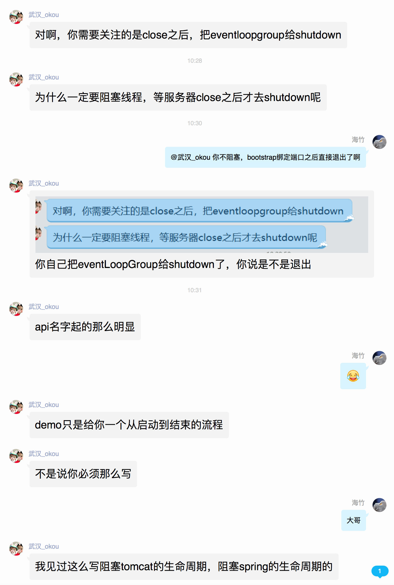

# 启动多个server的时候如何处理

教程中的范例：

```java

```




```java
package com.adolphor.mynety.server;

import com.adolphor.mynety.common.constants.Constants;
import com.adolphor.mynety.server.config.Config;
import com.adolphor.mynety.server.lan.LanOutBoundInitializer;
import io.netty.bootstrap.ServerBootstrap;
import io.netty.channel.ChannelFuture;
import io.netty.channel.EventLoopGroup;
import io.netty.handler.logging.LoggingHandler;
import lombok.extern.slf4j.Slf4j;

import static com.adolphor.mynety.common.constants.Constants.LOG_LEVEL;

/**
 * entrance of server
 *
 * @author Bob.Zhu
 * @Email adolphor@qq.com
 * @since v0.0.1
 */
@Slf4j
public class ServerMainTest {

  public static void main(String[] args) throws Exception {

    logger.debug("test sync...");
    ChannelFuture future1 = null;
    try {
      ServerBootstrap serverBoot = new ServerBootstrap();
      final EventLoopGroup bossGroup = (EventLoopGroup) Constants.bossGroupType.newInstance();
      final EventLoopGroup workerGroup = (EventLoopGroup) Constants.bossGroupType.newInstance();
      serverBoot.group(bossGroup, workerGroup)
          .channel(Constants.serverChannelClass)
          .handler(new LoggingHandler(LOG_LEVEL))
          .childHandler(InBoundInitializer.INSTANCE);
      future1 = serverBoot.bind(Config.PROXY_PORT).sync();
      future1.channel().closeFuture().addListener(f -> {
        logger.debug("ss服务端监听");
        bossGroup.shutdownGracefully();
        workerGroup.shutdownGracefully();
      });
    } catch (Exception e) {
      logger.error("ss服务端启动出错：：", e);
    } finally {
      logger.debug("ss服务端启动 结束");
      if (future1 != null) {
        logger.debug("ss服务端 手动停止...");
        future1.channel().close();
      }
    }

    ChannelFuture future2 = null;
    try {
      ServerBootstrap serverBoot = new ServerBootstrap();
      final EventLoopGroup bossGroup = (EventLoopGroup) Constants.bossGroupType.newInstance();
      final EventLoopGroup workerGroup = (EventLoopGroup) Constants.bossGroupType.newInstance();
      serverBoot.group(bossGroup, workerGroup)
          .channel(Constants.serverChannelClass)
          .handler(new LoggingHandler(LOG_LEVEL))
          .childHandler(LanOutBoundInitializer.INSTANCE);
      future2 = serverBoot.bind(Config.LAN_SERVER_PORT).sync();
      future2.channel().closeFuture().addListener(f -> {
        logger.debug("LAN服务端监听");
        bossGroup.shutdownGracefully();
        workerGroup.shutdownGracefully();
      });
    } catch (Exception e) {
      logger.error("LAN服务端启动出错：：", e);
    } finally {
      logger.debug("LAN服务端启动 结束");
      if (future2 != null) {
        logger.debug("LAN服务端 手动停止...");
        future2.channel().close();
      }
    }

  }
}

```

